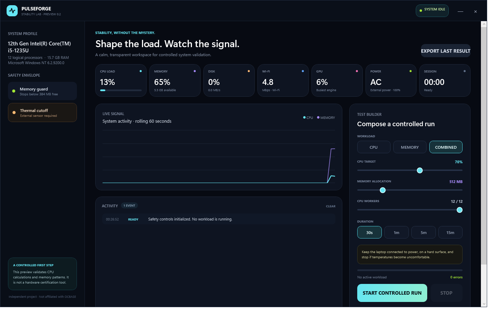

# PulseForge

PulseForge is an original Windows stability-testing preview with a calm, signal-focused interface. It is independently implemented and is not affiliated with OCBASE or OCCT.



## Included in preview 0.1

- Controlled CPU load from 25–100% across a selectable number of logical processors
- Repeated deterministic CPU calculations with checksum verification
- Full write/read memory pattern sweeps in guarded 16 MB blocks
- CPU, memory, and combined test modes
- 30-second, 1-minute, 5-minute, and 15-minute presets
- Live CPU and memory graphing through native Windows telemetry
- Live disk utilization and transfer-rate telemetry
- Active Wi-Fi traffic rate and adapter details
- GPU utilization from Windows GPU Engine counters
- Manual cancellation and an automatic low-memory safety stop
- JSON result export
- No administrator privileges required

## Important safety limits

PulseForge cannot currently read hardware temperature sensors and therefore cannot enforce a thermal cutoff. Keep laptops connected to power and on a hard, ventilated surface. Stop a run if the chassis becomes unusually hot, fans behave abnormally, the display glitches, or the system becomes unresponsive.

This preview deliberately does **not** implement GPU, VRAM, power-supply, or disk-write stress. Those workloads require vendor-specific telemetry and stronger safeguards.

## Run

Open `publish/PulseForge.exe`. It targets the built-in Windows .NET Framework 4.8 runtime.

## Build from source

```powershell
& 'C:\Program Files\Microsoft Visual Studio\2022\Community\MSBuild\Current\Bin\MSBuild.exe' PulseForge.csproj /p:Configuration=Release
```

## Verification mode

The packaged application supports a short non-visual smoke test:

```powershell
PulseForge.exe --smoke-test result.json
```

This runs a three-second, low-intensity combined test and writes a JSON result.
